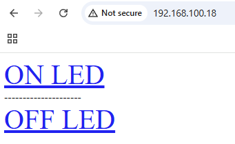

# ESP32 Web Server LED Control

- This project demonstrates how to use an ESP32 to create a simple web server that allows you to control an LED through a browser.

## 1. Overview

The ESP32 connects to a Wi-Fi network and hosts a small web server on port 80.
From the web page, you can turn the LED ON or OFF using GPIO D2 ESP by clicking the respective buttons.

## 2. Code 

```cpp
#include <Arduino.h>     // Core Arduino functions
#include <WiFi.h>        // WiFi library for ESP32
#include <WebServer.h>   // HTTP WebServer library

const char* ssid = "CAFE CAY BANG";     // Wi-Fi network name
const char* password = "113113113";     // Wi-Fi password

WebServer server(80);    // Create a web server running on port 80 (default HTTP port)

// Function to display the main web page
void viewer()
{
  String html = "<html><body>";
  html += "<a href='/on' style='font-size:40px;'>ON LED</a>";       // Button to turn LED ON
  html += "<div>---------------------</div>";                        // Divider line
  html += "<a href='/off' style='font-size:40px;'>OFF LED</a>";     // Button to turn LED OFF
  server.send(200, "text/html", html);                              // Send HTML response to browser
}

// Function to handle LED ON request
void turnOnLed()
{
  digitalWrite(4, HIGH);   // Turn LED ON (GPIO 4 HIGH)
  String html = "<html><body>";
  html += "<div>---------------------</div>";
  html += "<a href='/on' style='font-size:40px;'>ON LED</a>";       // Return updated page
  server.send(200, "text/html", html);
  Serial.println("LED ON");     // Print status to Serial Monitor
}

// Function to handle LED OFF request
void turnOffLed()
{
  digitalWrite(4, LOW);    // Turn LED OFF (GPIO 4 LOW)
  String html = "<html><body>";
  html += "<a href='/on' style='font-size:40px;'>ON LED</a>";       // Return updated page
  html += "<div>---------------------</div>";
  server.send(200, "text/html", html);
  Serial.println("LED OFF");    // Print status to Serial Monitor
}

void setup() {
  Serial.begin(9600);          // Initialize serial communication at 9600 baud
  pinMode(4, OUTPUT);          // Set GPIO 4 as output for LED control
  
  Serial.println("\nStarting WiFi connection...");
  WiFi.begin(ssid, password);  // Connect to Wi-Fi network

  // Wait until connected to Wi-Fi
  while (WiFi.status() != WL_CONNECTED) {
    Serial.print("..");        // Print dots while waiting
    delay(100);
  } 

  Serial.println("\nConnected to WiFi network."); 
  Serial.println(WiFi.localIP());   // Display ESP32 local IP address

  // Define server routes (URLs)
  server.on("/", viewer);      // Main page
  server.on("/on", turnOnLed); // Turn LED ON
  server.on("/off", turnOffLed); // Turn LED OFF
  
  server.begin();              // Start the web server
}

void loop() {
  server.handleClient();       // Handle incoming HTTP requests from browser
}

```

## 3. Output




- Click ON LED --> LED turns ON
- Click OFF LED --> LED turns OFF


