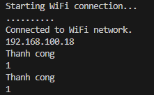
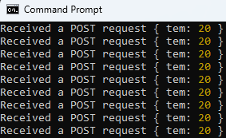

# ESP32 Client and Node.js Server Project

## 1. Overview

- This project demonstrates how to use an ESP32 board as an HTTP client to send data to a Node.js (Express) server.
- The ESP32 connects to a Wi-Fi network, formats sensor data (in this example, temperature), and sends it to the server using an HTTP POST request.
- The Node.js server listens for incoming POST requests, receives the JSON payload, and prints it to the console.

## 2. Features

**ESP32 (main.cpp)**

- Connects to a specified Wi-Fi network.
- Uses HTTPClient to send JSON data to the server.
- Prints connection status and server response on the Serial Monitor.
- Demonstrates how an IoT device can push sensor data to a web service.

**Node.js Server (server.js)**
- Built using the Express.js framework.
- Handles both GET and POST requests:
    - GET / → returns a simple HTML message.
    - POST / → receives JSON data from ESP32 and logs it to the console.
- Responds with a JSON object confirming success.

## 3. How It Works

- ESP32 connects to Wi-Fi using SSID and password.
- ESP32 prepares JSON data (example: { "tem": 20 }).
- ESP32 sends data via HTTP POST request to the Node.js server (default: http://<server_ip>:3000/).
- Node.js server logs the received data and sends a response (1 = success).
- ESP32 prints "Thanh cong" (Success) or "That bai" (Failure) based on the response.

## 4. Code Examples

**main.cpp** (ESP32 Client)
```cpp
#include <Arduino.h>
#include <WiFi.h>
#include <WebServer.h>
#include <HTTPClient.h>

// WiFi credentials
const char* ssid = "CAFE CAY BANG";        // WiFi network name (SSID)
const char* password = "113113113";        // WiFi password

// URL of the Node.js server (replace with your PC’s IP address)
const char* url = "http://192.168.100.11:3000/";  

void setup() {
  Serial.begin(9600);                      // Start serial communication at 9600 baud rate
  Serial.println("\nStarting WiFi connection...");

  WiFi.begin(ssid, password);              // Connect to WiFi network

  // Wait until connected
  while (WiFi.status() != WL_CONNECTED) {
    Serial.print("..");                    // Print dots while connecting
    delay(100);
  } 

  Serial.println("\nConnected to WiFi network.");
  Serial.println(WiFi.localIP());          // Print ESP32 local IP address
}

void loop() {
  // Check if WiFi connection is still active
  if (WiFi.status() == WL_CONNECTED) {
    HTTPClient http;                       // Create HTTP client object
    http.begin(url);                       // Initialize connection to the server
    http.addHeader("Content-Type", "application/json"); // Set request header for JSON data

    // Create JSON data to send
    String jsonData = "{\"tem\": 20}";     // Example JSON object: temperature = 20

    // Send HTTP POST request and store the response code
    int res = http.POST(jsonData);

    // Check response status
    if (res > 0) {
      Serial.println("Thanh cong");        // Means “Success” in Vietnamese
      Serial.println(http.getString());    // Print server response body
    } else {
      Serial.println("That bai");          // Means “Failed” in Vietnamese
      Serial.println(http.getString());    // Print response (may be empty if failed)
    }

    http.end();                            // Close connection and free resources
  }

  delay(5000); // Wait 5 seconds before sending the next request
}
```

**server.js** (Node.js Server)
```javascript
// Import the Express framework
const express = require('express');

// Create an instance of an Express application
const server = express();

// Define the port number where the server will run
const port = 3000;

// Middleware to parse JSON data from incoming requests
server.use(express.json());

// Handle GET requests to the root URL ('/')
// When a client visits this URL in a browser, it will respond with simple HTML text
server.get('/', (req, res) => {
  res.send("<div style='color: red'>Hello World!</div>");
});

// Handle POST requests to the root URL ('/')
// This is where the ESP32 will send JSON data using an HTTP POST request
server.post('/', (req, res) => {
  console.log("Received a POST request", req.body); // Print the received JSON data to the console
  res.json(1); // Send back a JSON response (in this case, just number 1 to indicate success)
});

// Start the server and begin listening for incoming connections
server.listen(port, () => {
  console.log(`Example app listening on port ${port}`);
});
```

## 5. Output






