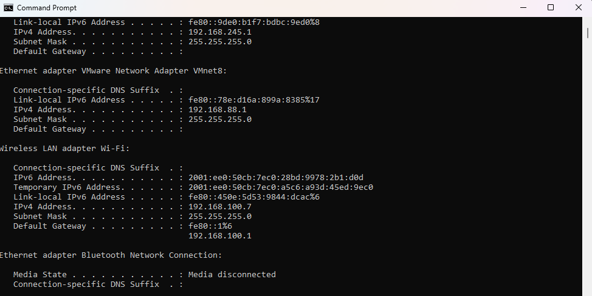
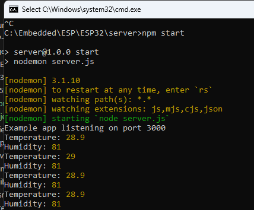
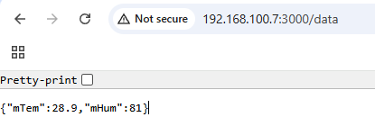
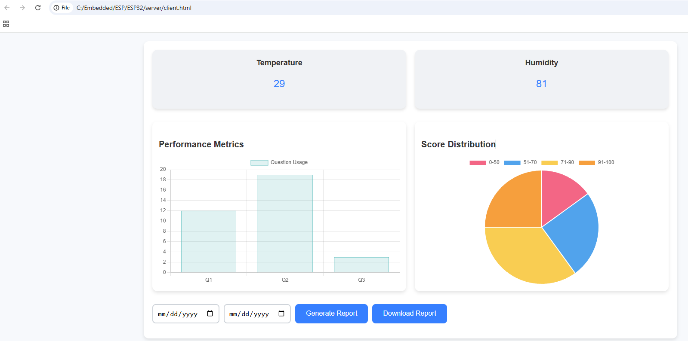

# ESP32 + DHT11 + Node.js Data Logger

This guide explains how to read temperature and humidity from a DHT11 sensor using an ESP32, send the data to a Node.js server, and retrieve it when needed.

## 📋 Table of Contents

- [Required Hardware](#required-hardware)
- [Software Requirements](#software-requirements)
- [Hardware Connections](#hardware-connections)
- [Overview of Operation](#overview-of-operation)
- [Node.js Server Setup](#nodejs-server-setup)
- [Testing the System](#testing-the-system)
- [Notes](#notes)

## 🔧 Required Hardware

- **ESP32 Development Board**
- **DHT11 Temperature & Humidity Sensor**
- **Jumper wires**
- **10kΩ pull-up resistor** (optional, for stable readings)

## 💻 Software Requirements

### Arduino IDE Setup
- **Arduino IDE** with ESP32 support installed

### Required Arduino Libraries:
- `DHT sensor library` (Adafruit)
- `Adafruit Unified Sensor`
- `WiFi library` (ESP32 core)
- `HTTPClient library` (ESP32 core)

### Node.js Setup
- **Node.js** installed on a computer or server

### Required Node.js packages:
```bash
npm install express cors
```

## 🔌 Hardware Connections

Connect the DHT11 sensor to the ESP32:

| DHT11 Pin | ESP32 Pin |
|-----------|-----------|
| VCC       | 3.3V      |
| GND       | GND       |
| DATA      | GPIO 2 D2   |

> **Note:** For more stable readings, a 10kΩ pull-up resistor can be connected between VCC and DATA.

## ⚙️ Overview of Operation

1. The **ESP32** connects to a WiFi network
2. It reads temperature and humidity values from the **DHT11** sensor periodically
3. The **ESP32** sends the data to the Node.js server via HTTP POST requests in JSON format
4. The **server** stores the latest values in memory
5. The stored data can be retrieved using HTTP GET requests from the server

## 🚀 Node.js Server Setup

1. **Install Node.js** and required packages (`express` and `cors`)
2. The server listens on a specific port (e.g., `3000`)
3. **Incoming POST requests** from the ESP32 update temperature and humidity values on the server
4. **GET requests** return the latest temperature and humidity values as JSON

### Server Installation Steps:
```bash
npm init -y
npm install express cors
```

## 🧪 Testing the System

1. **Power the ESP32** and connect it to WiFi
2. **Ensure the Node.js server** is running and reachable over the local network
3. **Observe the ESP32** sending data to the server
4. **Use a web browser** or HTTP client to access the server's GET endpoint to see the current data


## 📝 Notes

- ⚠️ Both **ESP32** and **Node.js server** must be on the same network for proper communication
- ⏱️ Adjust the sensor reading interval according to your needs
- 💾 The server can be extended to store data in a database or a file for logging purposes
- 🛠️ Adding error handling in the ESP32 code and server improves reliability

## Output

- Ipconfig 



- Set up Server





- User web html to view data

